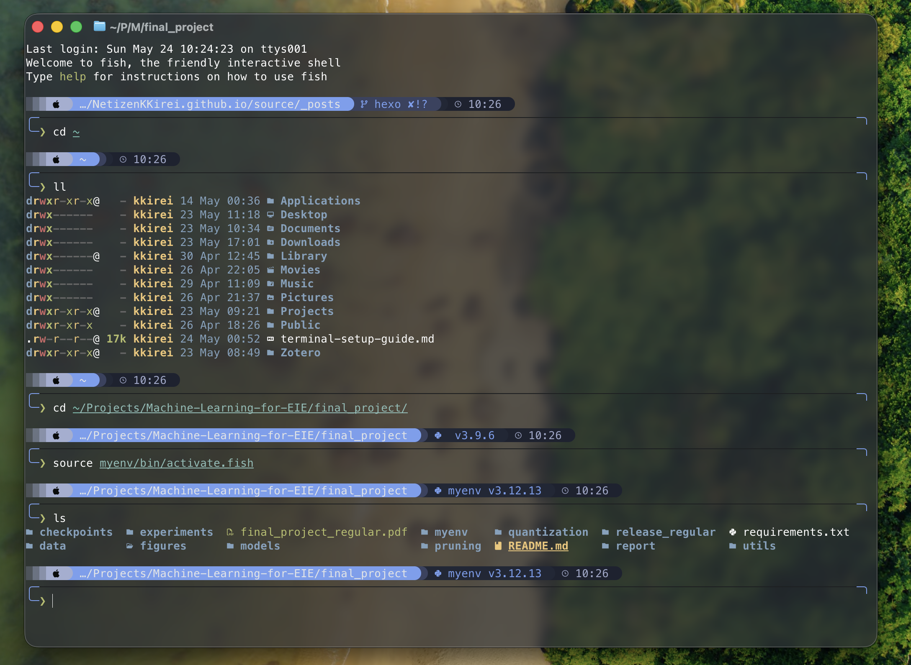

# 为你的MacOS打造现代化终端：Ghostty + Fish + Starship 配置分享 

> *前段时间不堪忍受天天背着死重的游戏本和电源跑来跑去，加上开始越来越频繁地接触 Linux ，也想试试macOS这种类Unix系统，怒而购入 macbook air，到手之后惊为天人。要不是还要玩游戏我都想把原来那台 win本砸了😠*

>*最直观的感受就是轻便和强大的续航，不用再被插座绑架，曾经的我还对“生产力”一词嗤之以鼻，<del>现在发现能随时随地开盖干活就有被爽到（什）！</del> 另外简洁的文件管理和清晰的环境配置也深得我心，不用像 windows 一样在一大坨乱七八糟的文件里翻垃圾真是太好了。一想到 win 里面我自己都记不住的文件路径以及史一般难用的 cmd 和poweshell 就没有打开的欲望，简而言之我已成为🍎孝子！*

## 前言
本人高频率用终端的时间其实并不长，之前也用过 zsh + oh my zsh 的搭配，但是这一套太重了，omz启动要加载一大堆插件，对我来说这带来的卡顿严重影响了使用体验，遂没用多久就放弃了。现在这套搭配是在冲浪的时候刷到的，研究了一下发现很匹配我自己的需求，主要是以下几个优势：
- **Ghostty** 采用GPU加速渲染，交互输出非常流畅，也能自定义窗口界面的外观配置。
- **Fish** 本身已经集成好语法高亮、自动建议和补全等功能，不用额外安装和管理插件，配置更加简单干净，开箱即用。
- **Starship** 是用Rust编写的高性能提示符美化器，能高速渲染出信息丰富美观的命令行提示符。

这套配置可能被诟病的点在于fish的语法与传统bash不同，没法兼容bash的脚本，也就是**牺牲部分兼容性换取极致的执行效率**。但对我来说完全不成问题，<del>因为本人就算要写脚本也全都是交给大模型的（逃）</del>

## 总览

目前我的终端由三部分构成：

| 层级 | 工具 | 功能 |
|------|------|------|
| 终端模拟器 | **Ghostty** | 窗口渲染、字体、背景透明/模糊 |
| Shell | **Fish** | 命令解析、别名、交互体验 |
| 提示符 | **Starship** | 美化命令行提示符，展示 Git/语言版本等信息 |

此外还用到 **eza**（ls 的现代替代品）和 **MesloLGS Nerd Font Mono**（含图标字形的等宽字体）。

最终效果预览


---

## 第〇步：配置国内镜像源

在中国大陆直接访问 Homebrew 的默认源会很慢甚至超时，因此在安装工具之前，先配置好下载镜像源。

### 1. Homebrew 镜像原理

Homebrew 包含三个独立的核心组件，各有独立的镜像地址：

| 组件 | 环境变量 | 作用 |
|------|---------|------|
| brew 自身仓库 | `HOMEBREW_BREW_GIT_REMOTE` | brew自身的安装/更新以及 formulae 索引 |
| API 元数据 | `HOMEBREW_API_DOMAIN` | brew 4.0+ 使用 JSON API 获取包信息 |
| 预编译包 (bottles) | `HOMEBREW_BOTTLE_DOMAIN` | 下载预编译的二进制包，避免本地编译 |


### 2. 安装 Homebrew 时指定镜像

这里暂时在mac的默认终端即zsh中执行：

```bash
# 参考：下面是我自己的镜像配置
export HOMEBREW_BREW_GIT_REMOTE="https://mirrors.ustc.edu.cn/brew.git"
export HOMEBREW_API_DOMAIN="https://mirrors.tuna.tsinghua.edu.cn/homebrew-bottles/api"
export HOMEBREW_BOTTLE_DOMAIN="https://mirrors.tuna.tsinghua.edu.cn/homebrew-bottles"

# 安装homebrew，git clone 时就会走上面的镜像地址
/bin/bash -c "$(curl -fsSL https://raw.githubusercontent.com/Homebrew/install/HEAD/install.sh)"
```

> **注**：主包这里配置比较混乱的原因，是当初配置的时候清华源非常拥堵，所以改用了科大的镜像，但后来在安装一些依赖的时候发现有缺失，于是又换回了清华源。

### 3. 持久化镜像配置（Shell 启动时自动设置）

安装完成后，需要将镜像配置写入 Shell 配置文件，让每次打开终端都生效。

**如果使用 Zsh（macOS 默认）**，写入 `~/.zprofile`：

```bash
# ~/.zprofile
export HOMEBREW_PIP_INDEX_URL="http://mirrors.aliyun.com/pypi/simple"
export HOMEBREW_API_DOMAIN="https://mirrors.aliyun.com/homebrew/homebrew-bottles/api"
export HOMEBREW_BOTTLE_DOMAIN="https://mirrors.aliyun.com/homebrew/homebrew-bottles"
eval $(/opt/homebrew/bin/brew shellenv)
```

> **说明**：`brew shellenv` 将 Homebrew 的可执行路径和环境变量注入当前 Shell 会话。放在 `~/.zprofile` 中是让 Zsh 在启动时加载。

**Fish**

在后文安装好fish后，需要回来为fish再设置通用变量：

```fish
# Fish 中设置 homebrew 镜像（通用变量，一次设置永久生效）
set -Ux HOMEBREW_API_DOMAIN "https://mirrors.tuna.tsinghua.edu.cn/homebrew-bottles/api"
set -Ux HOMEBREW_BOTTLE_DOMAIN "https://mirrors.tuna.tsinghua.edu.cn/homebrew-bottles"
set -Ux HOMEBREW_BREW_GIT_REMOTE "https://mirrors.tuna.tsinghua.edu.cn/git/homebrew/brew.git"
```

> **说明**：`set -Ux` 是 Fish 特有的语法——`-U` 表示 Universal（通用变量，跨会话持久化），`-x` 表示 export（导出为环境变量）。设置后所有 Fish 会话自动继承，无需修改配置文件。

此时可以用 `brew config` 验证镜像是否生效：

```
HOMEBREW_API_DOMAIN: https://mirrors.tuna.tsinghua.edu.cn/homebrew-bottles/api
HOMEBREW_BOTTLE_DOMAIN: https://mirrors.tuna.tsinghua.edu.cn/homebrew-bottles
HOMEBREW_BREW_GIT_REMOTE: https://mirrors.tuna.tsinghua.edu.cn/git/homebrew/brew.git
```

### 4. 常用国内镜像站速查

| 镜像站 | Homebrew bottles URL |
|--------|---------------------|
| 清华大学 tuna | `https://mirrors.tuna.tsinghua.edu.cn/homebrew-bottles` |
| 中科大 USTC | `https://mirrors.ustc.edu.cn/homebrew-bottles` |
| 阿里云 | `https://mirrors.aliyun.com/homebrew/homebrew-bottles` |

---

## 第一步：安装所有工具

通过 Homebrew 一次性安装：

```bash
brew install ghostty     # 终端模拟器
brew install fish        # Shell
brew install starship    # 命令行提示符
brew install eza         # ls 的现代替代，支持图标和颜色
```

安装 Nerd Font（Starship 和 eza 的图标显示依赖）：

```bash
brew install --cask font-meslo-lg-nerd-font
```

> **版本信息（本文编写时）**：Ghostty 1.3.1 · eza v0.23.4


---

## 第二步：打开 Ghostty

在应用程序中或 Spotlight 搜索 **Ghostty**，双击打开。

此时你会看到 Ghostty 的终端窗口，由于目前还没有配置fish为默认终端，里面仍运行着 macOS 的默认 Shell（通常是 Zsh）。

> Ghostty 本质上只是一个**窗口壳**——负责渲染字体、管理窗口、处理键盘输入，但窗口里运行的 Shell 程序取决于用户设置。

---

## 第三步：将 Fish 设为默认 Shell

这一步让系统知道「以后打开终端时运行 Fish 而不是 Zsh」。

### 1. 将 Fish 加入系统 Shell 白名单

macOS 只允许 `/etc/shells` 中列出的 Shell 被设为默认 Shell。Homebrew 安装的 fish 路径是 `/opt/homebrew/bin/fish`，不在系统默认白名单中，需要手动添加：

```bash
echo /opt/homebrew/bin/fish | sudo tee -a /etc/shells
```

### 2. 切换默认 Shell

```bash
chsh -s /opt/homebrew/bin/fish
```

`chsh` 是 "change shell" 的缩写，执行完成后，**关闭当前 Ghostty 窗口再重新打开**，你看到的就是 Fish 了。

### 3. 验证

重新打开 Ghostty 后，你会看到 Fish 的默认提示符：

```
Welcome to fish, the friendly interactive shell
```

此时还是 Fish 自带的朴素外观，下一步我们开始美化。

---

## 第四步：配置 Ghostty（终端外观）

Ghostty 的配置写在两个文件中（后者覆盖前者）：

1. `~/.config/ghostty/config` —— 跨平台通用
2. `~/Library/Application Support/com.mitchellh.ghostty/config` —— macOS 专用

我们直接在ghostty中按 ```cmd+,``` 打开mac专用配置文件，在最下方写入如下配置：

```ini
font-family = MesloLGS Nerd Font Mono
window-padding-x = 2
background-opacity = 0.75
background-blur-radius = 18
macos-titlebar-style = transparent
```

| 配置项 | 值 | 作用 |
|--------|-----|------|
| `font-family` | `MesloLGS Nerd Font Mono` | 终端字体（含图标字形） |
| `window-padding-x` | `2` | 窗口左右内边距，去掉多余留白 |
| `background-opacity` | `0.75` | 背景不透明度，等于 25% 透明 |
| `background-blur-radius` | `18` | 背景磨砂模糊半径，数字越大越模糊 |
| `macos-titlebar-style` | `transparent` | macOS 标题栏透明，与窗口背景融为一体 |

Ghostty 会**热加载**配置——文件保存后立即生效，无需重启。

---

## 第五步：配置 Fish（别名 + 启动 Starship）

Fish 的主配置文件是 `~/.config/fish/config.fish`，仅在交互式启动时加载。

写入以下内容：

```fish
# 初始化 Starship 提示符
starship init fish | source

# eza 别名 —— 用现代化的 ls 替代品
alias ls='eza --icons'
alias ll='eza -l --icons'
alias la='eza -la --icons'
alias lt='eza --tree --icons'
```

逐行说明：

| 配置行 | 作用 |
|--------|------|
| `starship init fish \| source` | **启动 Starship**。Starship 接管 Fish 的提示符渲染，用你定制的外观展示信息 |
| `alias ls='eza --icons'` | 用 eza 替换 ls，`--icons` 显示文件图标 |
| `alias ll='eza -l --icons'` | 详细列表：权限、大小、修改时间 |
| `alias la='eza -la --icons'` | 显示全部文件（含隐藏文件）+ 详细信息 |
| `alias lt='eza --tree --icons'` | 树形展示目录结构 |

> Fish 自带语法高亮、自动补全和历史建议，无需安装任何插件。`starship init fish | source` 这行就是「启动 Starship」的入口——Starship 本身是一个独立程序，它通过 `init` 命令向 Fish 注入初始化脚本，接管提示符的渲染。

保存后重新打开 Ghostty 窗口，或者执行 `source ~/.config/fish/config.fish` 即可看到变化。

---

## 第六步：配置 Starship（提示符外观）

### 1. 使用官方预设

目前的starship还是未经配置的默认外观，但starship官方提供了许多可以通过一行命令一键配置的预设主题，通过[社区配置分享](https://starship.rs/zh-CN/presets/)预览主题和查看配置命令。

### 2. 自定义配置文件

官方预设只配置了基础部分，补充自定义内容可以自行编辑配置文件：

`~/.config/starship.toml`


## 总结

### 完整操作流程回顾

| 步骤 | 内容 |
|------|-----------|
| 第〇步 | 配置 Homebrew 镜像 |
| 第一步 | `brew install` 安装所有工具 |
| 第二步 | 打开 Ghostty |
| 第三步 | `chsh` 切换默认 Shell |
| 第四步 | 写 Ghostty 配置文件 |
| 第五步 | 写 Fish 配置文件 |
| 第六步 | 写 Starship 配置文件 |

---

### 涉及文件一览

| 文件 | 作用 |
|------|------|
| `~/.zprofile` | Zsh 启动文件（Homebrew 镜像 + 路径） |
| `~/.config/ghostty/config` | Ghostty 字体设置 |
| `~/Library/Application Support/com.mitchellh.ghostty/config` | Ghostty 窗口外观（透明/模糊/标题栏） |
| `~/.config/fish/config.fish` | Fish 启动文件（Starship 初始化 + eza 别名） |
| `~/.config/starship.toml` | Starship 提示符的完整定制 |
| `~/Library/Fonts/MesloLGS*.ttf` | Nerd Font 字体文件 |

---

## 常见问题

### Q: 图标显示为方块/乱码？
A: 检查是否安装了 Nerd Font，并确认 Ghostty 的 `font-family` 指向了正确的字体名称。

### Q: 背景模糊/透明不生效？
A: 仅在 macOS 上支持。检查「系统设置 → 辅助功能 → 显示 → 减少透明度」是否关闭。

### Q: Fish 输入命令报 `command not found`？
A: Fish 的 PATH 与 Zsh 独立。执行 `fish -c 'echo $PATH'` 确认 `/opt/homebrew/bin` 在列表中。如果缺失，在 `config.fish` 中添加 `fish_add_path /opt/homebrew/bin`。

### Q: Homebrew 安装/更新仍然很慢？
A: 用 `brew config` 检查镜像变量是否生效。注意不同 Shell 的环境变量各自独立——在 Zsh 里配的镜像 Fish 继承不到，需要两边都配。


---

## 参考资料

- [Ghostty 官方文档](https://ghostty.org/docs/config)
- [Fish Shell 官方文档](https://fishshell.com/docs/current/)
- [Starship 官方配置文档](https://starship.rs/config/)
- [eza GitHub](https://github.com/eza-community/eza)
- [Nerd Fonts 官网](https://www.nerdfonts.com/)
- [清华大学 Homebrew 镜像帮助](https://mirrors.tuna.tsinghua.edu.cn/help/homebrew/)
- [中科大 Homebrew 镜像帮助](https://mirrors.ustc.edu.cn/help/homebrew-bottles.html)
